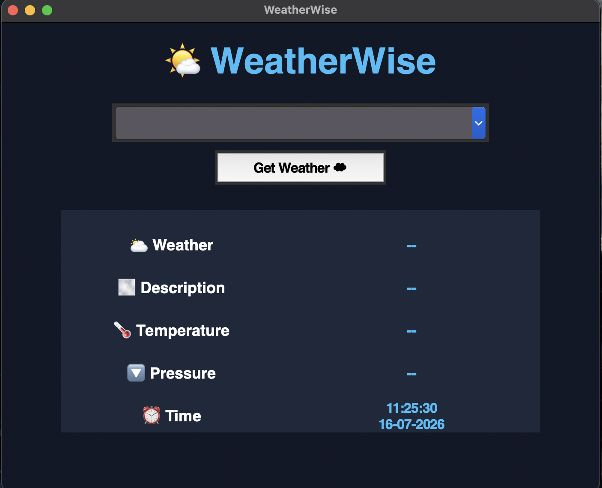
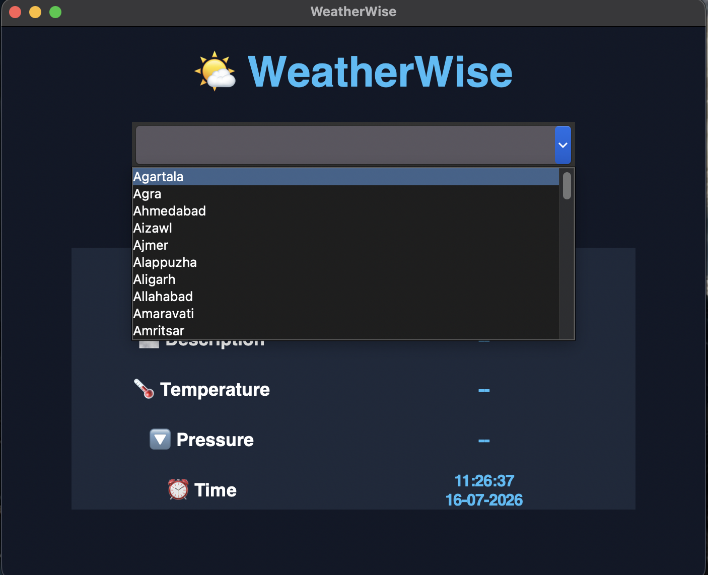
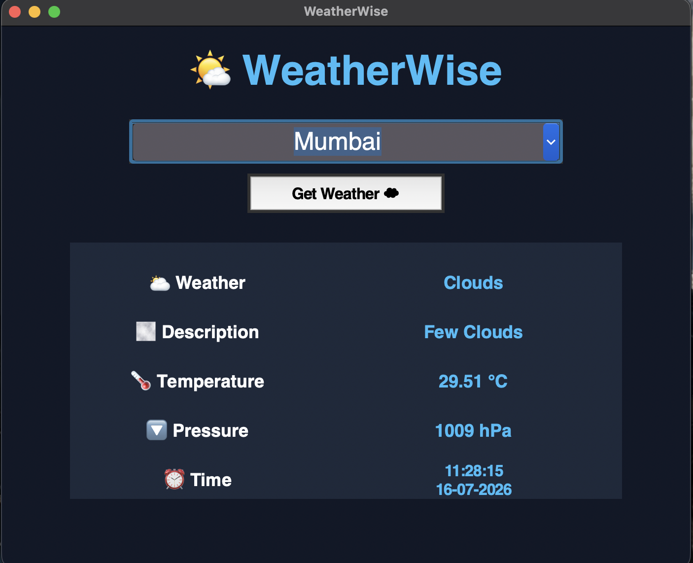

# WeatherWise-Tkinter

WeatherWise is a modern, lightweight Python desktop application that fetches and displays live, real-time weather information. Built using Python's robust Tkinter framework and integrating a live weather API, this project serves as a practical demonstration of GUI development, asynchronous API communication, and efficient JSON data parsing.

---

## 🚀 Key Features

*   **Real-Time Data Integration:** Connects directly to a live weather API to retrieve up-to-the-minute atmospheric data.
*   **Intuitive GUI:** Designed with a clean, user-friendly Tkinter desktop interface featuring a custom application banner and tailored weather icons.
*   **Smart Location Selector:** Features a streamlined dropdown selection system allowing users to smoothly input and query target cities.
*   **Comprehensive Data Display:** Breaks down complex JSON payloads into easily readable metrics including temperature, pressure, local time, and explicit weather summaries.

---

## 🛠️ Technical Specifications & Architecture

*   **Frontend Framework:** Python Tkinter (Standard GUI Library)
*   **Backend & Networking:** `requests` library for handling HTTP GET requests to the external Weather API.
*   **Data Serialization:** Built-in `json` parsing to decode API payloads dynamically.
*   **Asset Management:** Integrated local image asset loading (`.png`) for weather status icons and customized banners.

---

## 📋 Prerequisites

Before running the application, ensure you have Python installed on your system along with the required dependencies:

```bash
# Verify Python installation (Python 3.x required)
python --version

# Install the required requests library
pip install request

🖥️ Application Walkthrough

### Home Screen


### Search Process


**Step 1: Select a City**
* Click on the dropdown menu field located directly below the main WeatherWise title banner.
* Type or select the name of the city you want to check the weather for.

**Step 2: Fetch the Weather**
* Click the white **Get Weather ☁** button right below the input box.

### Search Results


**Step 3: View the Results**
Once clicked, the application will pull live data from the API and update the fields below:
* **Weather:** Displays the current condition icon and summary (e.g., Clear, Rain, Clouds).
* **Description:** Provides a detailed breakdown of the sky conditions.
* **Temperature:** Displays the current temperature reading.
* **Pressure:** Shows the atmospheric pressure.
* **Time:** Displays the exact time and date the data was fetched.
